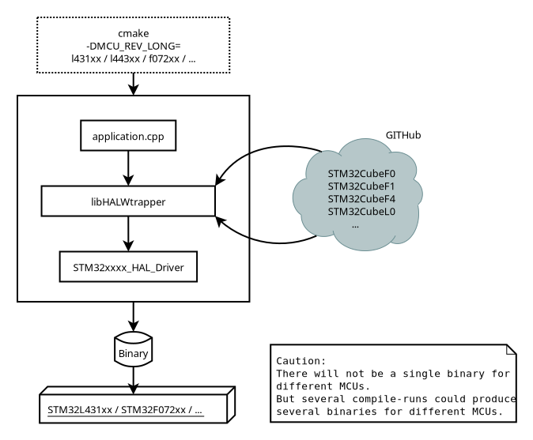

# LibHALWrapper

LibHALWrapper provides the HAL libraries from ST for STM32 along with CMSIS 
code and supplementary code.

This repository does not contain any HAL source files. The sources are 
automatically obtained from ST repositories. No source files of the downloaded
code should be changed because changes are not tracked in this repository and
may get overwritten automatically.

LibHALWrapper helps to develop application which are not determined for a 
specific MCU model. Generic code can be written and at compile time (more exact:
when running cmake) a specific MCU model gan be specified.



LibHALWrapper is used by the libraries "libbiwak" and "libarena". They provide 
further abstraction. This way the same application can be compiled for 
different MCU models or PCB layouts.

## Usage

The library should be used as subdirectory in a cmake project. But it can also 
be build standalone.

**Warning:**
It is not recommended to compile the library as standalone and to 
install it to the target sysroot. The startup code depends on the specific MCU
revision.

### Prerequisite

An toolchain for stm32 controllers has to be installed on the host and the system
must be configured to use the toolchain e.g. by having environment variables set 
correctly.

For flashing binaries to stm32 devices, "openocd" is needed on the host
system.

On an Debian based system, following packages can be used:

* arm-linux-gnueabihf
* g++-arm-linux-gnueabihf
* gcc-arm-linux-gnueabihf
* openocd
* gdb-multiarch

### CMake

The cmake variable "MCU_REV_LONG" has to specify the target MCU.
When running the cmake command, a script to obtain the source files from ST 
Github repositories. Per default, the repositories will be stored in 
"$HOME/.cache/HALWrapper". To use an different directory, the environment 
variable HAL_ARCHIVE_PATH can be set.
The correct compiler flags for the used Microcontroller have to be configured.
This can be done for example by setting CMake variables ( CMAKE_C_FLAGS, 
CMAKE_CXX_FLAGS, ...) or by providing a corresponding toolchain file.

**Warning:**
The repository does not set the necessarry compiler flags for the specific MCU.
They have to be set manually or in the husk cmake file.

**Example:**
```shell
mkdir -p build
cd build
cmake .. -DMCU_REV_LONG=f303x8
make -j$(nproc)
```

### Install Library files

**Warning:**
Do not install the library into the root filesystem of your host system.

**Example:**
```shell
make install DESTDIR=../install
``` 

## Building the example

[See this subpage]:doc/build_example.md
```{include} doc/build_example.md
```

